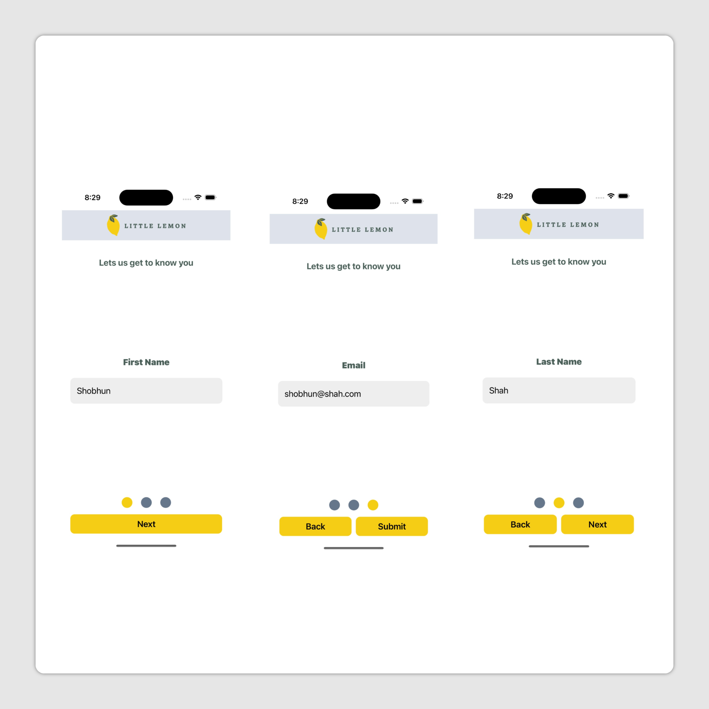
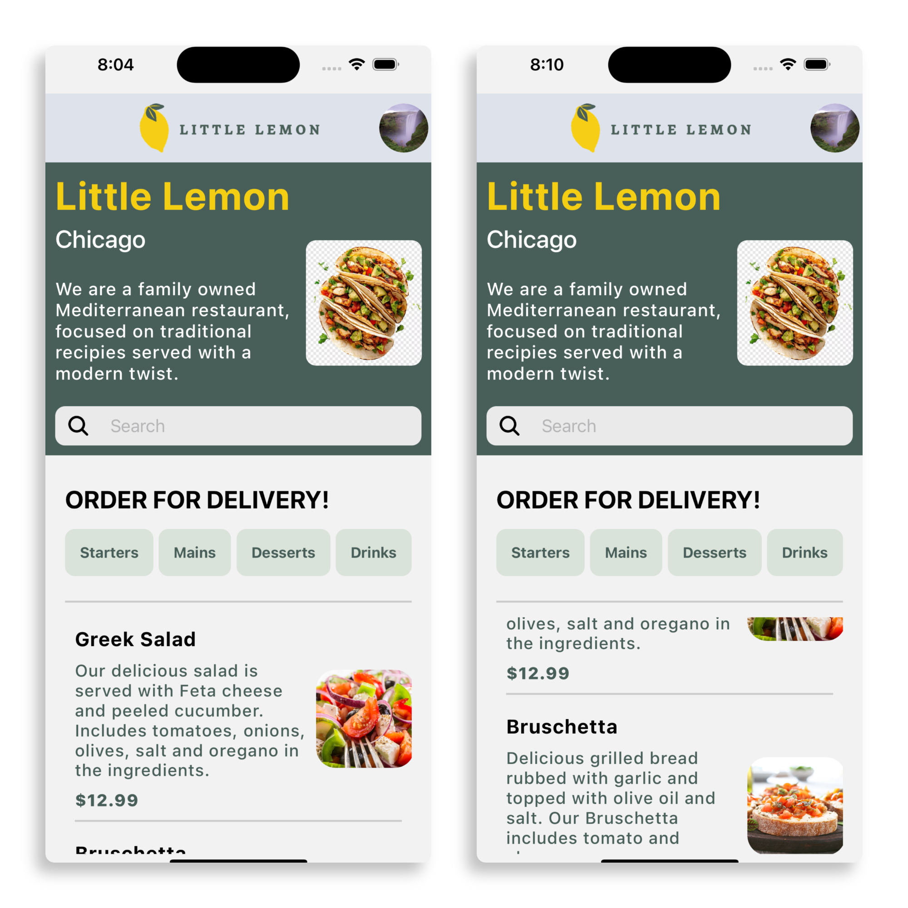
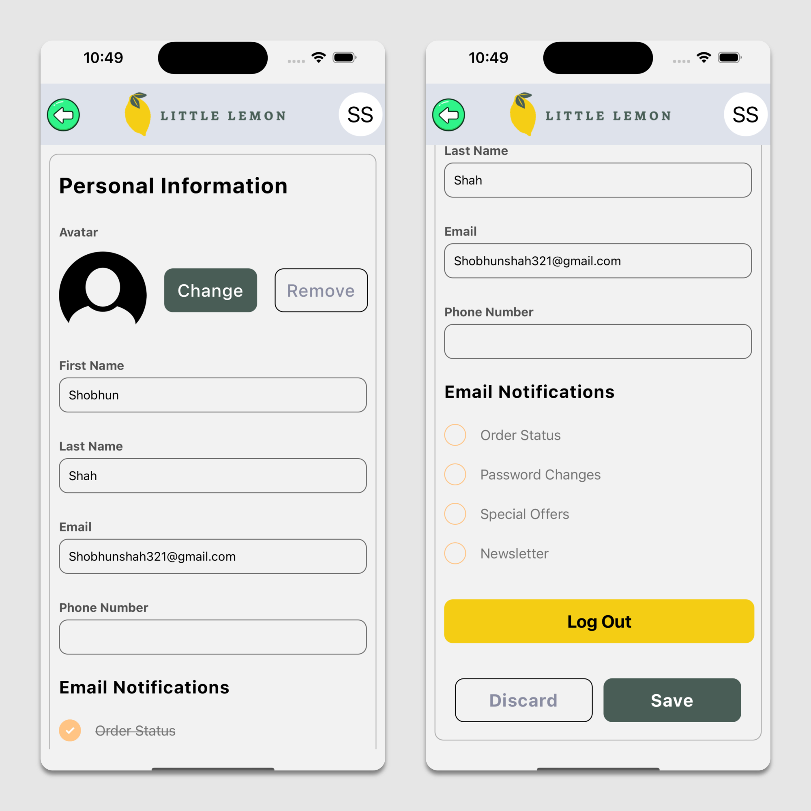

<<<<<<< HEAD
# Little Lemon App 🍋

A mobile restaurant application built as the **capstone project** for the [Meta React Native Specialization on Coursera](https://www.coursera.org/specializations/meta-react-native).  
The app simulates a food ordering experience for **Little Lemon Restaurant**, showcasing modern **React Native** development practices.

---

## 🚀 Features

- **Onboarding flow** with form validation  
- **Navigation** across multiple screens (stack)  
- **Menu browsing** with search and filtering  (WIP)
- **Persistent storage** using **SQLite** / **AsyncStorage**   (WIP)
- **API integration** for fetching menu data  (WIP)
- **Responsive UI** with custom styles and layouts  
- **Cross-platform support** (iOS & Android)

---

## 🛠️ Tech Stack

- [React Native](https://reactnative.dev/)  
- [Expo](https://expo.dev/)  
- [JavaScript](https://www.coursera.org/learn/programming-with-javascript)
- [React Navigation](https://reactnavigation.org/)  
- SQLite & AsyncStorage  
- GitHub for version control  

---

## 📸 Screenshots

| Onboarding | Home | Profile |
|------------|------|----------|
|  |  |  |

| Wireframe | 
|-----------|
|  |

---

## 📂 Project Structure

```bash
LittleLemonApp/
├── App.js                # Main entry point
├── README.md             # Project documentation
└── src
  ├── animations/         # Splash Animation    
  ├── components/         # Reusable UI components
  ├── constants/          # Navigation stack & tab config
  ├── context/            # to manage useContext
  ├── docs/               # Documentation files (images)
  ├── image/              # Images, fonts
  ├── navigation/         # Navigation stack config
  ├── screens/            # App screens (Home, Menu, Profile, etc.)
  ├── storage/            # Common place to store the files regarding React Native Storage
  └── utils/              # Single file for Validation.
```
---

## ▶️ Working Video

You can watch the demo here:  
[🎥 Download Certification App Demo](src/docs/screens/certificationApp.mp4)

```bash
└── src
  └── docs
    └── screens
      └── certificationApp.mp4
````


=======
# FinalProjectReact
Final project about course on Coursera
>>>>>>> da1d0658df7faa01621d91a266dbd3e093bb9af0
